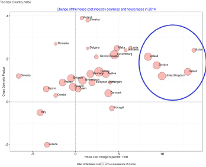
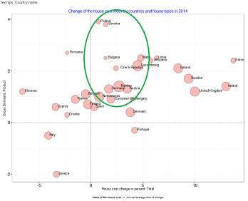
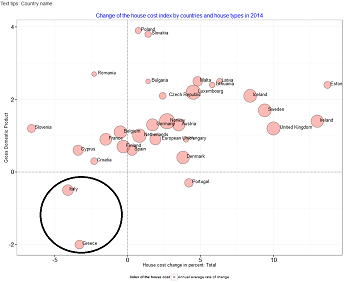
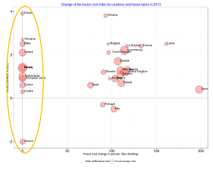

---
title       : DDP Project
subtitle    : Real Estate investment in  the european countries
author      : V.Kirilenko
logo        : kirilenko.png
job         : https://twitter.com/MobileVk
framework   : io2012        # {io2012, html5slides, shower, dzslides, ...}
highlighter : highlight.js  # {highlight.js, prettify, highlight}
hitheme     : tomorrow      # 
widgets     : [mathjax, bootstrap, quiz, shiny, interactive]     # {mathjax, quiz, bootstrap}
mode        : selfcontained # {standalone, draft}
knit        : slidify::knit2slides
--- 

## Description of the project

This apllication was built for to assist those who choose yourself attractive country for investment or residence.

When I create it I based upon the following assumptions:
<ul><li>A country with a large GDP growth is more attractive for investment in general.</li>
<li>A country with a higher salary is more attractive for investments in real estate, as it is a center of attraction of the active population,
while this population has the opportunity and the need (for example, because of the children) the purchase or long-term rental housing.</li>
<li>If in the past 10 years in the country marked positive trend value of the real estate, the most likely this trend will continue.</li> </ul>
Naturally, it is necessary to take into account the considerations for investment attractiveness and the probability overheating real estate market, the risk of which is not considered in this application.

In the case of considering the possibility of buying a undervalued property, it makes sense to look at countries which have significant GDP growth and stable real estate market.

--- .class

## How much you can earn?
The answer to this question depends on many factors, primarily on a correct choice of the investment object, of course.  
In the second place, it depends from the amount that you have. The borrowing is usually significantly reduces the yield of the project.  
In the third place, it depends also from the proper management of the facility that is best left to professionals.  

There are you can see change of the house index price in two years: 2013 and 2014.

```{r "Data load", echo = F, warning= F}
data2013 = readRDS("pi2013.RDS")
data2014 = readRDS("pi2014.RDS")
print(paste("Average growth of the house index in 2013: ",round(mean(data2013[data2013[["Unit"]] %in% "Annual average rate of change",7]), digits = 3)))
print(paste("Average growth of the house index in 2014: ",round(mean(data2014[data2014[["Unit"]] %in% "Annual average rate of change",7]), digits = 3)))
```

--- &twocol
## What to look for?
*** =left
First, you may check the countries, which had significant GDP growth and bigger house price index.<br>
<br>
<br>
 <br>
*** =right
Second, you can pay your attention  to the countries where a high level of GDP growth combined with a stable market.<br>
<br>
<br>


--- &twocol
## Cautions
*** =left
In any case, countries that have near-zero or negative GDP growth and a constantly declining real estate prices may not be considered 
or as candidates for investment, either as candidates for living.<br>
<br>
  
*** =right
Note that in the absence of data in some categories from the consideration necessary to exclude objects that have a zero index.<br>
<br>
<br>
<br>



